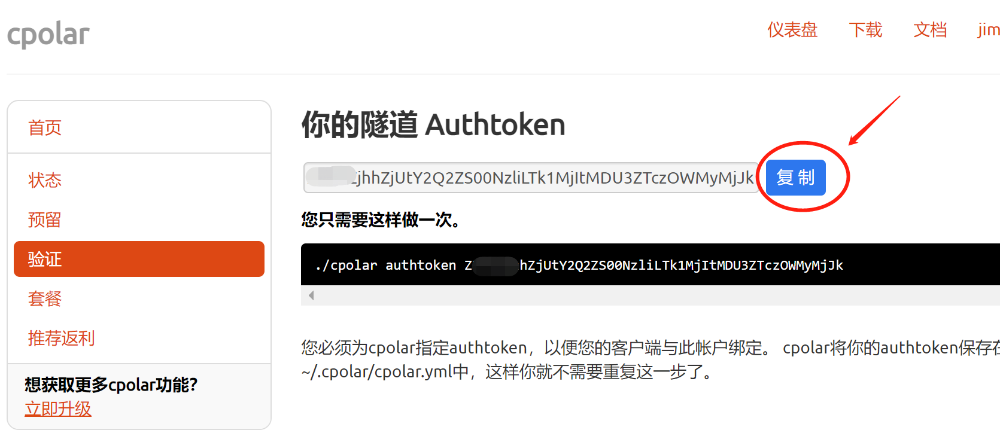
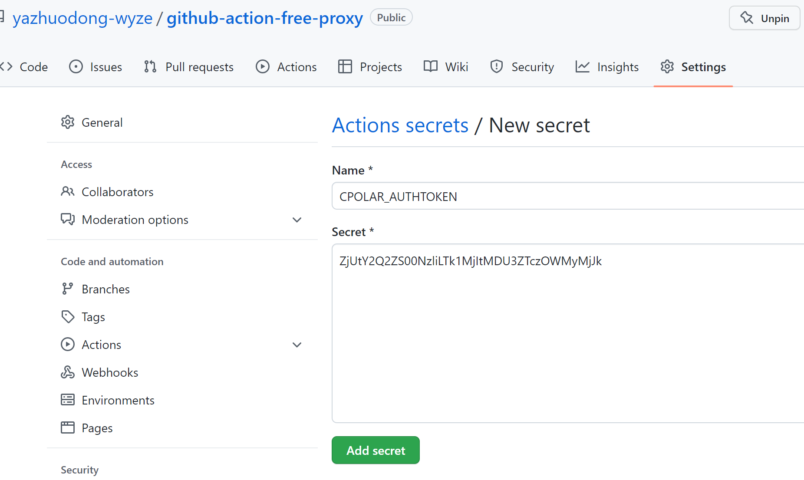
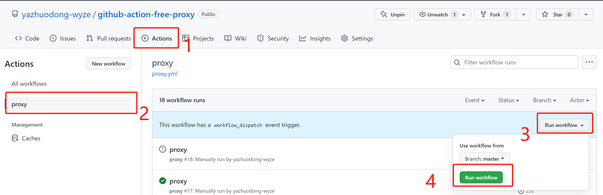
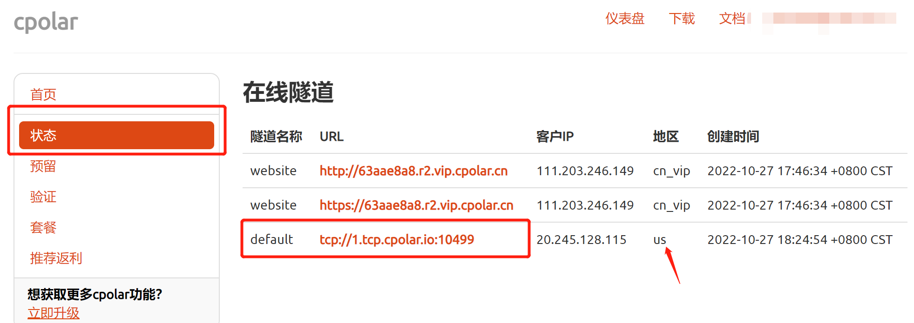
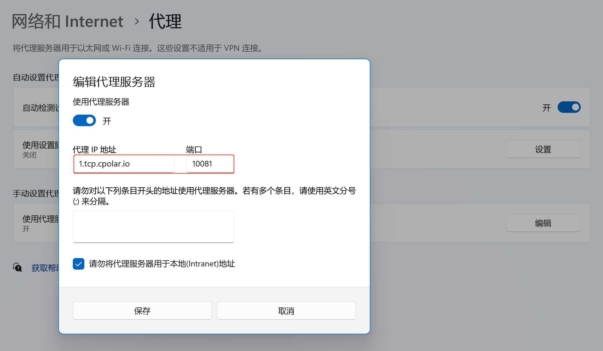
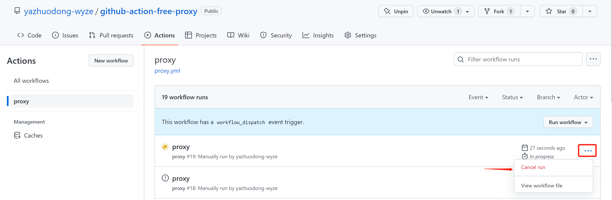

# 程序说明

利用[GitHub Actions](https://docs.github.com/cn/actions/using-workflows) 和 [Cpolar](https://i.cpolar.com/m/4DDq)，进行每月2000分钟的外网访问。只需要使用邮箱申请一个[Cpolar](https://i.cpolar.com/m/4DDq)，然后Fork本仓库,配置一下GitHub Secrets,不需要安装任何附加软件。
# 使用说明

#### 1.Fork 当前仓库。  
#### 2.使用邮箱注册[Cpolar](https://i.cpolar.com/m/4DDq)。  
#### 3.复制 [Cpolar](https://i.cpolar.com/m/4DDq) Authtoken。  
#### 4.找到Fork好的仓库的GitHub Secrets。  
#### 5.`New repository secret`,复制 [Cpolar](https://i.cpolar.com/m/4DDq) Authtoken 到 Actions secrets，Name必须使用 `CPOLAR_AUTHTOKEN`   
#### 6.运行 代理 GitHub Actions。  
#### 7.在[Cpolar](https://i.cpolar.com/m/4DDq) 上找到代理地址，找到地区是`us`(如果找不到请取消GitHub Action,重新运行)。  
#### 8.使用你的代理。   
#### 9.取消GitHub Actions(一个月默认2000分钟)。  
